# Denstar Fitness Weight Tracker API

**Course:** TT00CD85 - Backend Programming  
**Student:** Dennis Kiplimo (AG3949)  
**Date:** April 2026  
**Institution:** JAMK University of Applied Sciences

---

## Project Overview

This project is a production-ready REST API for the Denstar Fitness Weight Tracker — a feature of [denstarfitness.com/tools](https://denstarfitness.com/tools), a live fitness calculator platform with 48+ tools.

The weight tracker tool currently saves data to the browser's localStorage. This API adds cloud persistence — users can register, log in, and sync their weight data across devices.

**Live API:** https://denstar-api.onrender.com

---

## Architecture

```
Client (denstarfitness.com/tools/trackers/weight-tracker)
        ↓
Express REST API (denstar-api.onrender.com)
        ↓
MongoDB Atlas (denstar database)
```

### Tech Stack

| Layer | Technology |
|---|---|
| Runtime | Node.js |
| Framework | Express.js v4 |
| Database | MongoDB Atlas |
| ODM | Mongoose |
| Authentication | JWT (jsonwebtoken) |
| Password hashing | bcryptjs |
| Security | Helmet, CORS |
| Deployment | Render |

---

## Data Models

### User

```javascript
{
  name: String,        // required
  email: String,       // required, unique, lowercase
  password: String,    // required, hashed with bcryptjs
  createdAt: Date      // auto-generated
}
```

### WeightEntry

```javascript
{
  user: ObjectId,      // reference to User
  weight: Number,      // required, 20-500
  unit: String,        // 'kg' or 'lbs', default 'kg'
  date: Date,          // required, default now
  notes: String,       // optional, max 200 chars
  createdAt: Date,     // auto-generated
  updatedAt: Date      // auto-generated
}
```

**Index:** `{ user: 1, date: 1 }` unique — one entry per user per date

---

## API Endpoints

### Authentication

| Method | Endpoint | Description | Auth |
|---|---|---|---|
| POST | `/api/auth/register` | Register a new user | No |
| POST | `/api/auth/login` | Login and get JWT token | No |
| GET | `/api/auth/me` | Get current user | Yes |

### Weight Entries

| Method | Endpoint | Description | Auth |
|---|---|---|---|
| GET | `/api/weights` | Get all weight entries | Yes |
| POST | `/api/weights` | Add a new weight entry | Yes |
| DELETE | `/api/weights/:id` | Delete a weight entry | Yes |
| GET | `/api/weights/stats` | Get weight statistics | Yes |

### Health Check

| Method | Endpoint | Description |
|---|---|---|
| GET | `/health` | API health check |

---

## Request & Response Examples

### Register

**Request:**
```http
POST /api/auth/register
Content-Type: application/json

{
  "name": "Dennis Kiplimo",
  "email": "dennis@example.com",
  "password": "password123"
}
```

**Response:**
```json
{
  "success": true,
  "token": "eyJhbGciOiJIUzI1NiIsInR5cCI6IkpXVCJ9...",
  "user": {
    "id": "69ebb521d47171f93a803987",
    "name": "Dennis Kiplimo",
    "email": "dennis@example.com"
  }
}
```

### Login

**Request:**
```http
POST /api/auth/login
Content-Type: application/json

{
  "email": "dennis@example.com",
  "password": "password123"
}
```

**Response:**
```json
{
  "success": true,
  "token": "eyJhbGciOiJIUzI1NiIsInR5cCI6IkpXVCJ9...",
  "user": {
    "id": "69ebb521d47171f93a803987",
    "name": "Dennis Kiplimo",
    "email": "dennis@example.com"
  }
}
```

### Add Weight Entry

**Request:**
```http
POST /api/weights
Authorization: Bearer <token>
Content-Type: application/json

{
  "weight": 75.5,
  "unit": "kg",
  "date": "2026-04-24",
  "notes": "Morning weight"
}
```

**Response:**
```json
{
  "success": true,
  "data": {
    "_id": "69ebc123d47171f93a803999",
    "user": "69ebb521d47171f93a803987",
    "weight": 75.5,
    "unit": "kg",
    "date": "2026-04-24T00:00:00.000Z",
    "notes": "Morning weight"
  }
}
```

### Get Weight Statistics

**Response:**
```json
{
  "success": true,
  "data": {
    "totalEntries": 10,
    "currentWeight": 74.2,
    "startWeight": 78.0,
    "lowestWeight": 74.2,
    "highestWeight": 78.0,
    "totalChange": -3.8,
    "movingAverage": 74.8
  }
}
```

---

## Project Structure

```
denstar-api/
├── src/
│   ├── app.js              ← Express app entry point
│   ├── db/
│   │   └── mongodb.js      ← MongoDB connection
│   ├── models/
│   │   ├── User.js         ← User model
│   │   └── WeightEntry.js  ← Weight entry model
│   ├── controllers/
│   │   ├── auth.js         ← Auth logic
│   │   └── weights.js      ← Weight entry logic
│   ├── routes/
│   │   ├── auth.js         ← Auth routes
│   │   └── weights.js      ← Weight routes
│   ├── middleware/
│   │   ├── auth.js         ← JWT verification
│   │   └── errorHandler.js ← Global error handler
│   └── utils/
│       └── jwt.js          ← JWT utilities
├── .env                    ← Environment variables (gitignored)
├── .gitignore
├── package.json
└── README.md
```

---

## Security

- **Helmet** — sets secure HTTP headers
- **CORS** — restricted to `https://denstarfitness.com`
- **bcryptjs** — passwords hashed with salt rounds of 10
- **JWT** — tokens expire in 7 days
- **Mongoose validation** — input validated at schema level
- **Duplicate key handling** — proper 409 response for duplicate emails
- **Unique index** — prevents duplicate weight entries per date per user

---

## Setup and Installation

```bash
# Clone the repository
git clone https://github.com/kiplimodev/denstar-api.git
cd denstar-api

# Install dependencies
npm install

# Create .env file
cp .env.example .env
# Fill in your values

# Run in development
npm run dev

# Run in production
npm start
```

### Environment Variables

```
PORT=3000
MONGO_URI=mongodb+srv://...
JWT_SECRET=your_secret
JWT_EXPIRES_IN=7d
NODE_ENV=production
FRONTEND_URL=https://denstarfitness.com
```

---

## Deployment

The API is deployed on **Render** at `https://denstar-api.onrender.com`.

Deployment is automatic — pushing to the `main` branch on GitHub triggers a new build on Render.

---

## Next Steps

The immediate next step is **frontend integration** — connecting the weight tracker UI at `denstarfitness.com/tools/trackers/weight-tracker` to this API. The UI is already built and designed for cloud sync. Integration requires:

1. Creating Next.js API bridge routes that forward requests to this Express API
2. Replacing localStorage calls with authenticated API calls
3. Handling JWT token storage on the client side

---

## Time Spent

| Task | Hours |
|---|---|
| Project planning and setup | 1 |
| Data models (User, WeightEntry) | 1 |
| Authentication (JWT, bcrypt) | 1.5 |
| Weight endpoints and stats | 1.5 |
| Error handling and validation | 1 |
| Testing with REST Client | 1 |
| Deployment to Render | 0.5 |
| Documentation | 1.5 |
| **Total** | **9 hours** |

---

## Self-Assessment

### What went well
- Clean separation of concerns — controllers, routes, models, middleware
- JWT authentication implemented from scratch following course patterns
- Meaningful error handling — validation errors, duplicate keys, 404s
- Deployment working with automatic redeploys on push
- Real-world use case — this API will power a live production tool

### What could be improved
- Tests — Vitest + SuperTest tests would strengthen the project
- Refresh tokens — more secure than long-lived JWT
- Rate limiting — prevent brute force attacks
- Frontend integration — the most valuable missing piece

### Most valuable achievement
Building a production API for a real product that already has users. The weight tracker at denstarfitness.com receives real traffic, making this backend directly useful beyond the course.

### Left for development
- Frontend integration with the weight tracker UI
- Rate limiting and additional security hardening
- Unit and integration tests
- In the longer term, migration to Better Auth + Neon PostgreSQL as part of the platform's planned architecture

---

## Screenshots

### API Testing
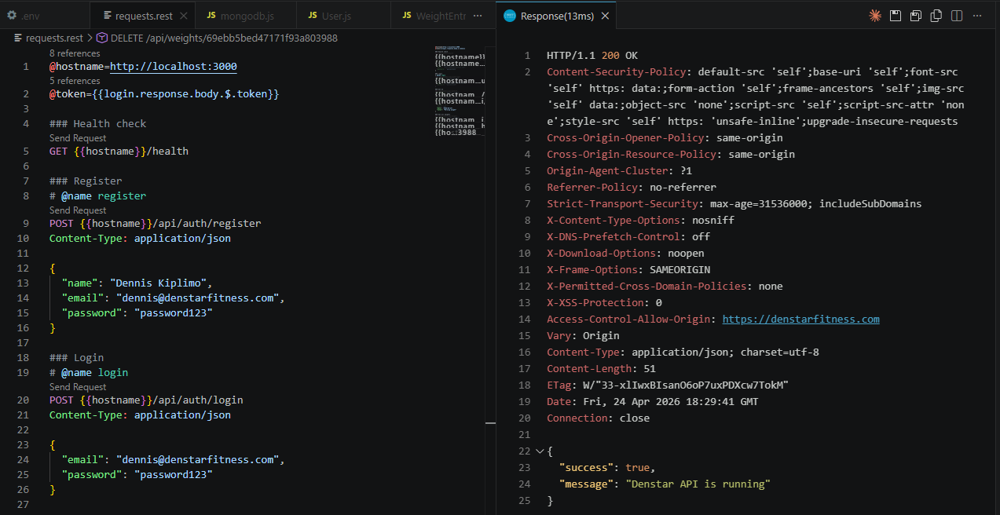
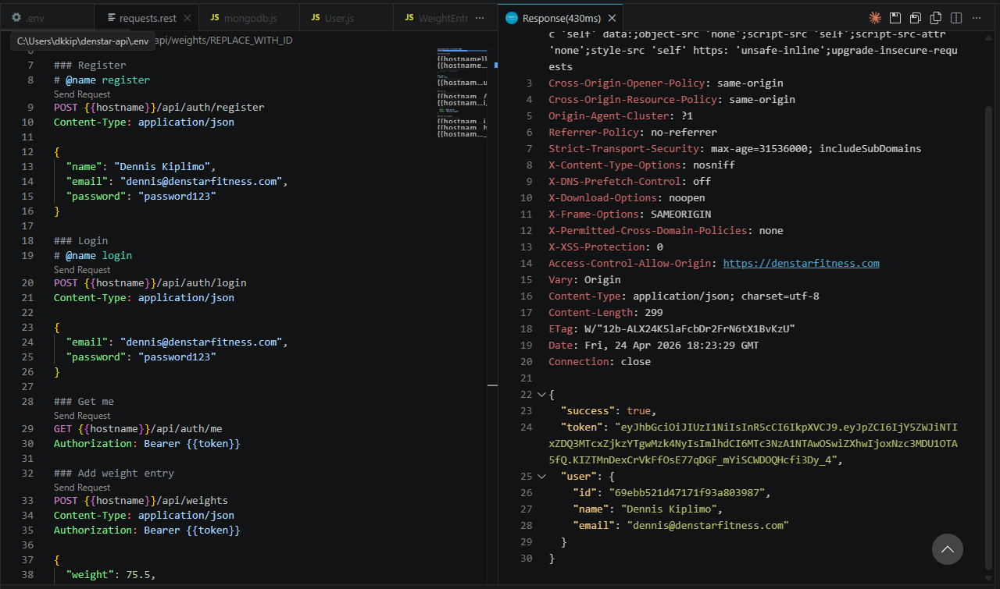
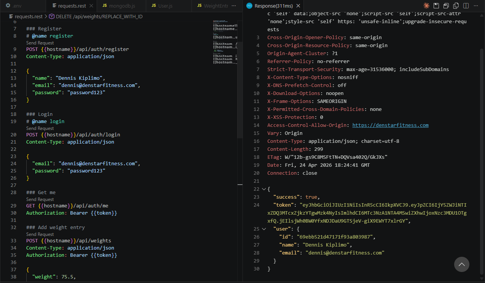
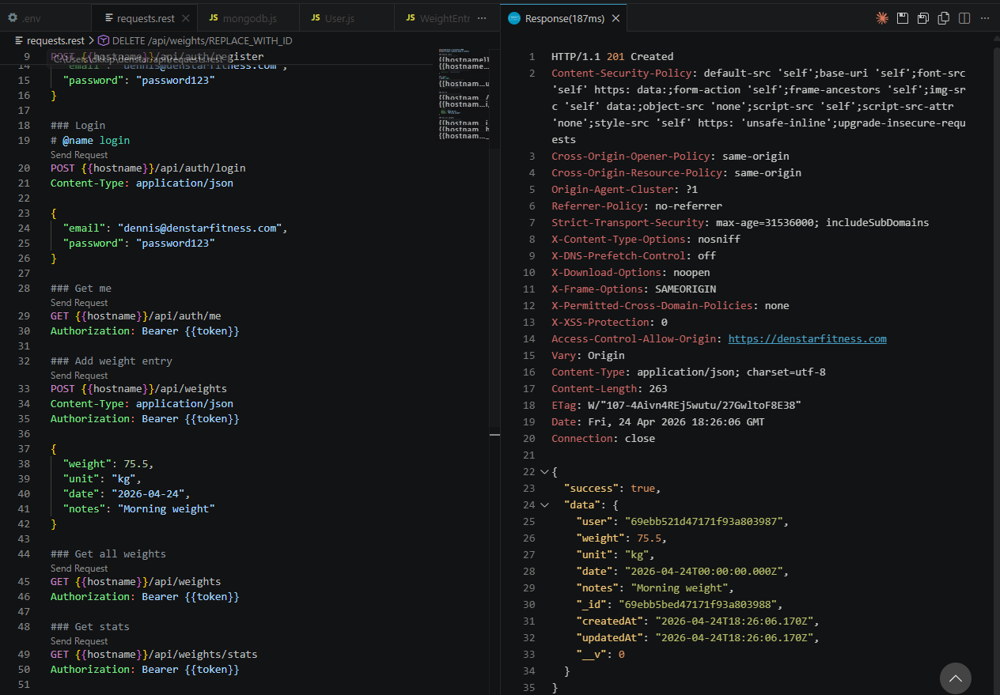
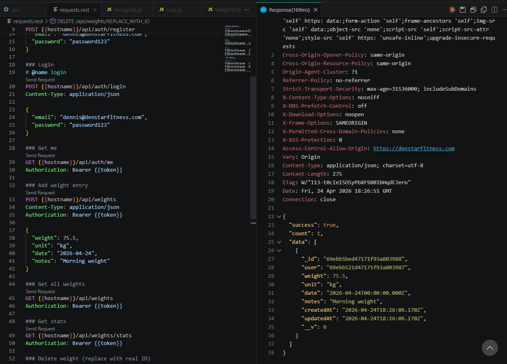
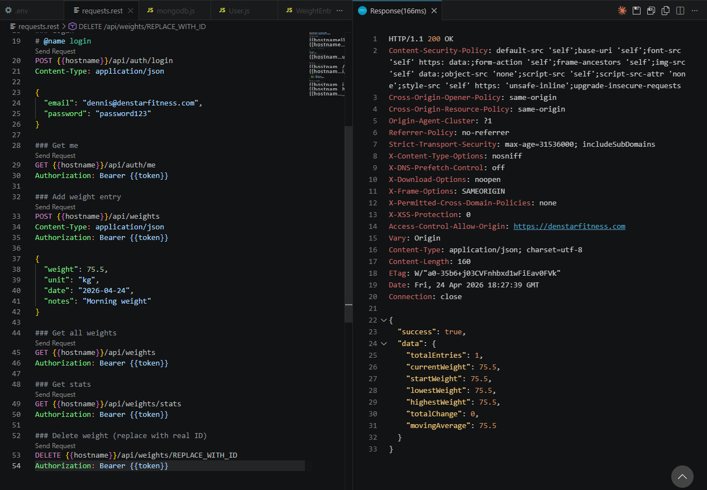
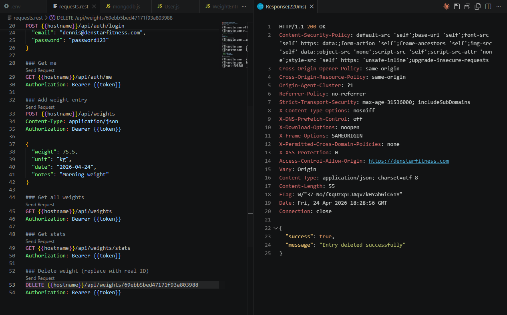

### MongoDB Atlas
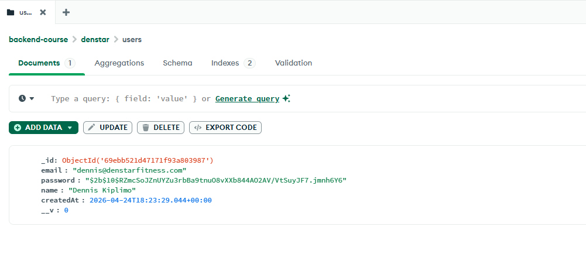
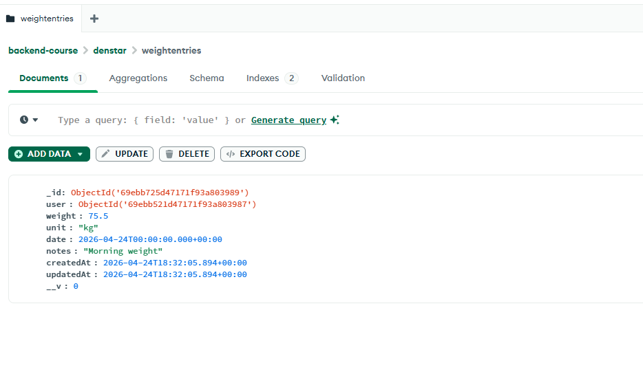

### Deployment
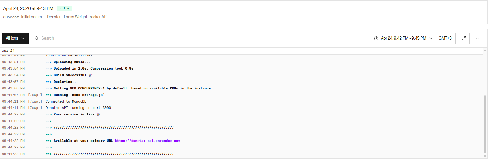
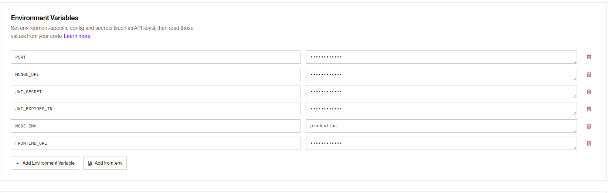
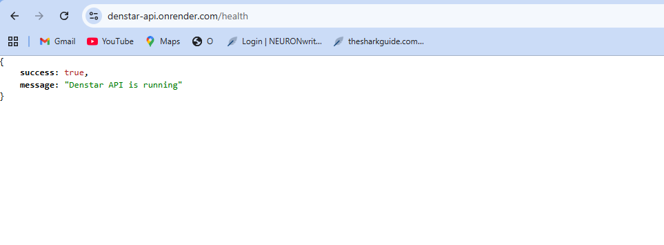
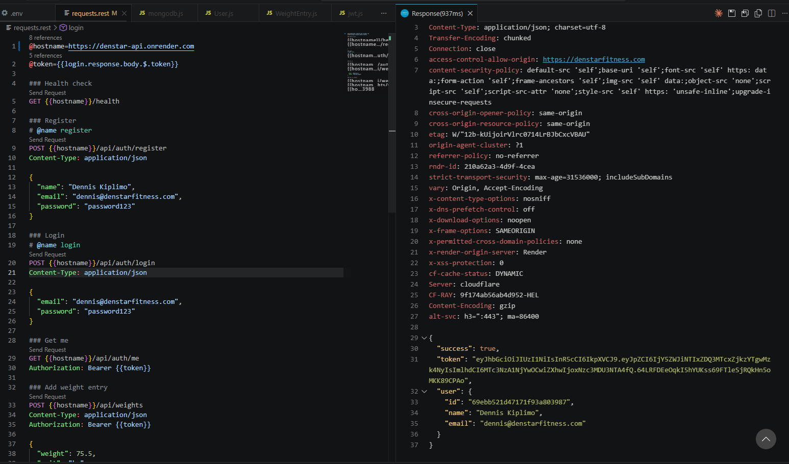